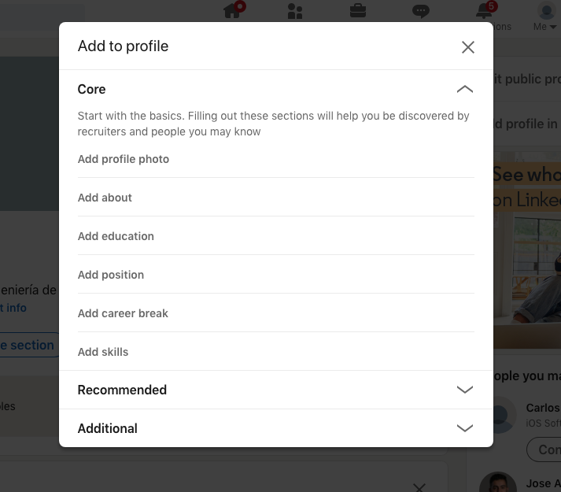

# Project: Create a professional LinkedIn page

## Learning objectives

- Create a clear, compelling LinkedIn page.

### **Estimated time**: 1.5h

## Description

In this project, we'll walk you through building and curating a strong, professional LinkedIn profile that will help showcase both your previous accomplishments and your future potential. This will be your first version, so it doesn't need to be perfect. If any errors exist, you'll receive a peer feedback that you'll be able to use to make improvements. Later on, in the job searching modules, you will have the opportunity to update and polish this profile with the support of a career coach.

### Why is a strong LinkedIn so important?

LinkedIn is one of the most widely-used professional networking services online, and having a great profile can result in both increased recruiter outreach and [a 71% higher chance of getting invited to job interviews](https://www.resumego.net/research/linkedin-interview-chances/). In order to create a profile that will grab a recruiter's attention, though, you'll need to fill every section as thoroughly as possible.

This might sound intimidating, but we have good news: **you've already written nearly everything you need for a great LinkedIn profile**.

**A note before you get started:** be sure to use English for all sections of your LinkedIn profile. If you're interested in potentially finding a job in another language, you can create a [secondary language profile](https://www.linkedin.com/help/linkedin/answer/1717/create-or-delete-a-profile-in-another-language?lang=en). However, the profile you submit should be entirely in English.

### Project Setup

1. If you don't already have a LinkedIn profile, [sign up for one here](https://www.linkedin.com).

## Thoroughly fill in the Intro Block

The LinkedIn profile header comprises everything in that first block of your LinkedIn profile, from your photo to your contact info. It also encompasses **almost all of the new content you'll be writing**; nearly everything else will be copy-pasted directly from your resume.

We'll discuss how to fill out each field step by step.

**Learn more about how to complete your LinkedIn Intro Block:**

[How do you complete your LinkedIn header?](order/how-do-you-complete-your-linkedin-header.md)

**Apply what you've learned**

1. Fill out your LinkedIn header/intro block with all of the required information listed in the linked lesson above.

## Fill in the About section

You will now add different sections to your profile by selecting them from the Add profile section menu, which displays a list of core, recommended and additional sections.

According to most students, the "About Me" is the hardest (and most intimidating) section of the LinkedIn profile. The good news, however, is that you've already written most of it, and now you can simply copy/paste it into LinkedIn.

**Learn more about the About section:**

[What makes a compelling About section?](order/what-makes-a-compelling-about.md)

**Apply what you've learned**

1. Copy/paste your elevator pitch, add the necessary information and preferred stack into the "About" section, and write a short call to action.

## Curate your list of featured projects

The Featured section is one of the first blocks that a hiring manager will see when they click into your profile: it's large, image-heavy, and located near the top of your LinkedIn. In other words, it's a space where you can immediately grab a recruiter's attention, and you should be using it to its fullest effect. This section appears as one of the Recommended sections in the Add profile section menu. Let's talk about what to add.

**Learn more about how to create an eye-catching Featured section:**

[What makes a strong Featured section?](order/what-makes-a-strong-featured-section.md)

**Apply what you've learned**

1. Take 5 minutes to select 3-5 pieces of media (projects, articles, etc.) that you'd like to add to the Featured section.
2. Take 10 minutes to add each piece of media to the Featured section, copy/pasting all relevant links and project summaries from GitHub into LinkedIn.

## Fill in the Experience section

The Experience section is the most important part of your LinkedIn profile. Here you list the positions that you have had in your professional career. This is where all recruiters will be spending most of their time. And guess what: you've already written all of it.

**Learn more about what to include in the Experience section:**

[Create an achievements-focused Experience section](order/create-an-achievements-focused-experience-section.md)

You will have to add your different work experiences, one by one. Follow these steps:
- Click on your profile picture at the upper right corner.
- Click on "Add profile section".
- Select "Add position" from the "Core" section.
- Fill in the required information in the form that appears.
- Click "Save".

**Apply what you've learned**

1. Take 10 minutes to copy/paste your experiences from your resume into LinkedIn. 
2. Take an additional 10 minutes to **use the checklist above** to verify that your Experience section is good to go.

## Fill in the Education section

You're more than halfway done with your LinkedIn profile, and we'll continue our copy/paste journey in the Education section. Again, you've already written everything you need.

**Learn how to highlight knowledge and professional expertise in the Education section:**

[What makes a strong Education section?](order/what-makes-a-strong-education-section.md)

**Apply what you've learned**

1. Take 5 minutes to copy/paste your education from your resume into LinkedIn.
2. Take an additional 10 minutes to **use the checklist found in the Experience lesson** to help identify any copy/paste errors.

## Add keywords to your LinkedIn by completing the Skills section

The Skills section is important because all of the skills you add to your profile become keywords, and keywords help recruiters find you. That means it's time for another round of copy-paste! Your list of skills is on your resume; highlight and start copy/pasting.

**Learn more about which skills to add to your LinkedIn:**

[Preparing your LinkedIn for both keyword searches and hiring managers with the Skills section](order/preparing-your-linkedin-for-both-keyword-searches-and-hiring-managers-with-the-skills-section.md)

**Apply what you've learned**

1. Take 5 minutes to copy/paste your skills from your resume into LinkedIn.
2. If relevant, take an additional 5 minutes to add technical or professional skills to your LinkedIn that you did not already include on your resume.

## Highlight your strengths with recommendations

Recommendations are a great way of providing context to recruiters and hiring managers who might be wondering what type of person and employee you would be. They tell a hiring manager more about how you work with other people, give your profile more credibility, and serve as a quick reference from other people who know about your work.

**Learn more about the art of writing recommendations:**

[How to ask for recommendations and write strong recommendations yourself](order/how-to-ask-for-recommendations-and-write-strong-recommendations-yourself.md)

**Apply what you've learned**

1. Take 5 minutes to send at least 1-3 recommendation requests to peers, mentors, previous managers, etc.
2. Take 15 minutes to write a recommendation for at least 1 peer, mentor, previous manager, etc. whom you enjoyed working with.

## Add your strongest projects

It's well-worth making time to do add your strongest projects, since hiring managers look closely at this section, and keyword-heavy descriptions allow LinkedIn's matching algorithm to rank you more strongly as a match for jobs.

Fortunately, all you need to do to complete this section is copy/paste directly from your GitHub.

**Learn more about adding your projects to your profile**

[Selecting what to include in the projects section](order/selecting-projects-and-other-achievements-for-the-accomplishments-section.md)

**Apply what you've learned**

1. Spend 10 minutes adding your strongest projects to LinkedIn, ensuring that each contains a working link (to either the repo or the live demo) **and** an approved project summary (copy/pasted from GitHub).

## Decide whether to include a Volunteer section

Many Microverse students eventually become mentors, so even if you don't currently have volunteer experience, you may gain some experience in the next couple of months. If you plan on becoming a mentor in the future, **set a calendar alert for two months from now** to remind you to add mentorship to the Volunteer section of LinkedIn.

If you already have volunteer experience, though (either at Microverse or anyone else), make sure to add it to your profile!

**Learn more about what to include in a Volunteer section:**

[How can you showcase volunteer experiences on LinkedIn?](order/how-can-you-showcase-volunteer-experiences-on-linkedin.md)

**Apply what you've learned**

1. If relevant, take 5 minutes to copy/paste your volunteer experience from your resume into LinkedIn.
2. Take an additional 5 minutes to **use the checklist found in the Experience lesson** to help identify any copy/paste errors.

## **Should you include other sections from the Recommended or Additional options?**

Sure! LinkedIn offers several types of blocks that can be added to your profile, including sections for publications, honors & awards, and languages. **We encourage you to add any other sections that may be relevant to you,** but keep in mind that you are meant to showcase **the best** of your accomplishments; adding a company award is much more valuable than adding an award from high school.

Two more things to keep in mind:

- **Don't** add test scores **unless** 1) you are a recent college graduate **AND** your test scores are extremely high (at least in the 90th percentile). If you do add test scores, make sure to include the percentile in the Description box (for example, *Title: GRE Verbal, Score: 167, Description: Scored in the 98th percentile*).
- Within the next 1-2 weeks, you'll be writing a **development-focused Article** as part of the Microverse curriculum. Set a reminder for one month from now: once you've completed that article, come back and add it to a Publication section that you can find in the Additional options.

**Apply what you've learned**

1. Take 5 minutes to add any Additional or Recommended sections applicable to you.

## Follow peers, companies or groups for your Interests section

In LinkedIn, you can follow people, companies or groups that will be included in your Interests section, which is generally **a section for you, not for hiring managers**. Your LinkedIn interests affect what sort of posts show up on your LinkedIn Activity feed, so choosing your Interests wisely can help if you plan on networking within certain companies or industries. 

If you created your LinkedIn account recently, you were probably prompted to select peers, companies, and organizations for this section. Now, you can add others by choosing to follow them. 

For this assignment, it's optional to follow others, but highly recommended.

**Learn more about how to (wisely) select entries for the Interests section:**

[Whom to follow (and whom to avoid following) in LinkedIn](order/what-to-include-and-what-not-to-include-in-the-interests-section.md)

**Apply what you've learned**

1. Spend 5 minutes selecting some additional professionals, companies or organizations to follow (optional).

## Start networking on LinkedIn (Optional)

LinkedIn is a great place to start networking. It includes an Activity section where the posts that you create or like from others will appear. For this assignment, creating possts and liking others' posts is **optional**. It won't affect the score that Microverse gives you for the LinkedIn project. Yet, it's highly recommended that you start having some activity in your feed. Why? Because LinkedIn activity is a bit like a video game boost: you can win without it, but it does make winning easier.

**Learn more about how to use LinkedIn to network:**

[Networking via LinkedIn](order/networking-via-linkedin.md)

**Apply what you've learned**

1. Optional: take 10-15 minutes to explore your LinkedIn feed and interact with someone else's post (or create a development-focused post yourself).

### Project Requirements

- [Make sure that your LinkedIn meets every requirement of the LinkedIn rubric.](https://docs.google.com/document/u/1/d/1MHmt3Vx4SRHa7z8PuoUiYg9eLakpi1qGPT6868bacGc/edit)

### Submission Instructions

1. Make sure that you have thoroughly completed each section of the LinkedIn profile.

## Additional materials

*These are all optional, but if you're interested in exploring this topic further, here are some resources to help you. Any exploration here should be done outside program time.*

- [How to build an amazing LinkedIn profile: 15 proven tips](https://cultivatedculture.com/linkedin-profile-tips/)
- [3 LinkedIn mistakes that could be costing you job offers](https://cultivatedculture.com/linkedin-mistakes/)

------
